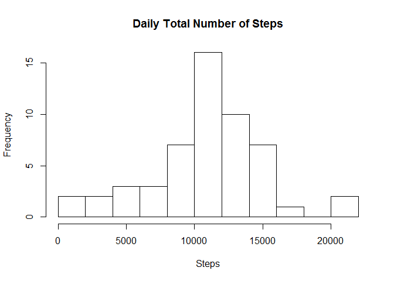
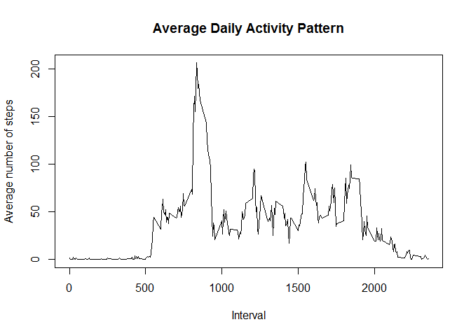
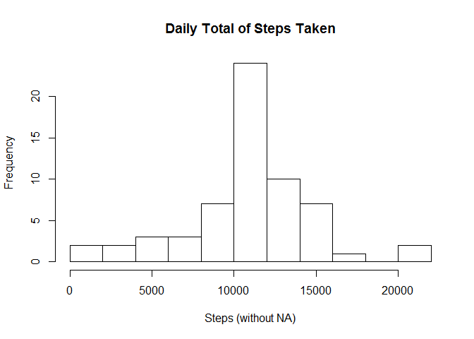
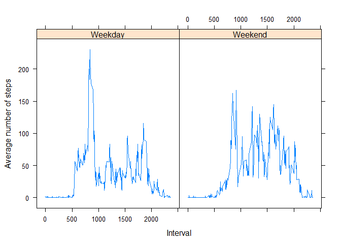

# Reproducible Research Assignment 1

Putting the echo = TRUE :


```r
echo = TRUE
```

##Loading and preprocessing the data


```r
activity <- read.csv("activity.csv", stringsAsFactors = FALSE)
```

I will also put the date in the data as a data and not a character 
as you can see below with the str command.


```r
str(activity)
```

```
## 'data.frame':	17568 obs. of  3 variables:
##  $ steps   : int  NA NA NA NA NA NA NA NA NA NA ...
##  $ date    : chr  "2012-10-01" "2012-10-01" "2012-10-01" "2012-10-01" ...
##  $ interval: int  0 5 10 15 20 25 30 35 40 45 ...
```

```r
activity$date <- as.Date(activity$date)
```

##What is mean total number of steps taken per day?

Ignoring first of all the missing value.


```r
activity2 <- activity[which(!is.na(activity$steps)),]
```

Histogram of the steps per day : 


```r
stepspday <- rowsum(activity2$steps, activity2$date)
stepspday <- data.frame(stepspday) 
hist(stepspday$steps, 10, main = "Daily Total Number of Steps", xlab = "Steps")
```

\

Calculating the median and mean :


```r
mean(stepspday$steps)
```

```
## [1] 10766.19
```

```r
median(stepspday$steps)
```

```
## [1] 10765
```

##What is the average daily activity pattern?

Plot : 


```r
activity3 <- tapply(activity2$steps, activity2$interval, mean)
plot(x = names(activity3), y = activity3, type = "l", main = "Average Daily Activity Pattern", xlab = "Interval", ylab = "Average number of steps")
```

\

5 Interval with the maximum number of steps : 


```r
activity3[which.max(activity3)]
```

```
##      835 
## 206.1698
```

##Imputing missing values

Number of missing values :


```r
sum(is.na(activity))
```

```
## [1] 2304
```

New dataset filling the NA with the 5 minute interval mean which makes more sense to me : 


```r
activity4 <- activity
activity4[which(is.na(activity4$steps)),1] <- activity3[as.character(activity4[which(is.na(activity4$steps)),3])]
```

New number of missing values :


```r
sum(is.na(activity4))
```

```
## [1] 0
```

New histogram :


```r
newstepspday <- tapply(activity4$steps, activity4$date, sum)
hist(newstepspday, 10, main = "Daily Total of Steps Taken", xlab = "Steps (without NA)")
```

\

Calculating the new median and mean :


```r
mean(newstepspday)
```

```
## [1] 10766.19
```

```r
median(newstepspday)
```

```
## [1] 10766.19
```

Impact almost null. Only change the median to put it a the exact level of the mean.

##Are there differences in activity patterns between weekdays and weekends?

New factor variable specifying if the day is a weekday or not :


```r
datefunction <- function(dates) {
  f <- function(date) {
    if (weekdays(date) %in% c("Saturday", "Sunday")) {
      "Weekend"
    }
    else {
      "Weekday"
    }
  }
  sapply(dates, f)
}

activity4$newdate <- as.factor(datefunction(activity$date))
```

New plots with the difference between weekdays and weekends :


```r
library(lattice)

stepspnewdate <- aggregate(steps ~ interval + newdate, activity4, mean)
xyplot(steps ~ interval | newdate, stepspnewdate, layout = c(2,1), type = "l", xlab = "Interval", ylab = "Average number of steps")
```

\
